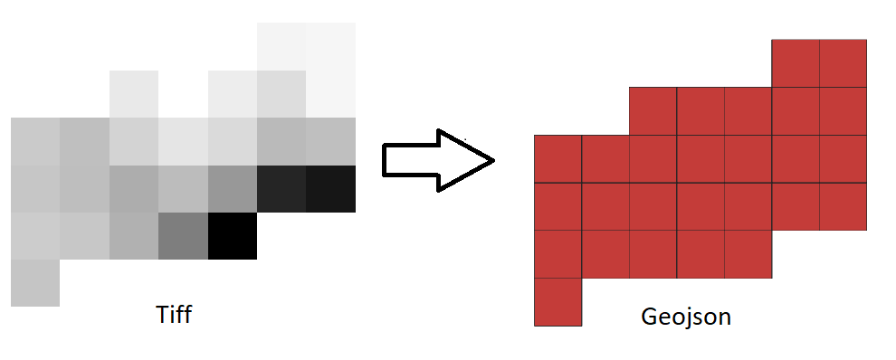

# Project Title

Tiff2Geojson

## Getting Started

This is the repo to convert the Tiff image files into geojson files with respect to the crs system

### Packages required

* [geopandas](https://geopandas.org/)
* [raterio](https://rasterio.readthedocs.io/en/latest/)

## sample output

## Authors

* **Mallikarjun Sajjan** - *Initial work* - [mullermuttu](https://github.com/millermuttu)

## Acknowledgments

* thanks to [Sentinelsat](https://sentinelsat.readthedocs.io/en/stable/) API

